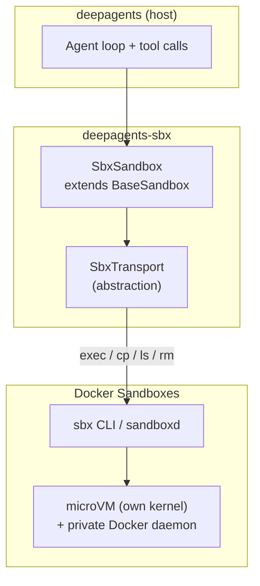

# deepagents-sbx

> Docker Sandboxes (`sbx`) microVM sandbox backend for [Deep Agents](https://github.com/langchain-ai/deepagents) — Python & JavaScript.

[](LICENSE)
[](https://pypi.org/project/deepagents-sbx/)
[](https://www.npmjs.com/package/deepagents-sbx)


Deep Agents ships sandbox backends for LangSmith, Daytona, Modal, Runloop,
Vercel, E2B and plain Docker — all of them ordinary containers. **None use the
`sbx` microVM.** This project fills that gap.

## Why a microVM backend

| `sbx` advantage | Value for an agent |
|---|---|
| microVM with its own kernel | Hard isolation boundary — no container-kernel escape |
| Private Docker daemon inside the VM | The agent can `docker build` / `docker run` (testcontainers, compose) |
| Network allow/deny policy | Real egress control for arbitrary generated code |
| Disposable | `sbx rm` when done — no leftover state |
| Free and already installed | The `sbx` CLI drives it; no cloud subscription required for local sandboxes |

## Repository layout

```
deepagents-sbx/
├── python/     → publishes deepagents-sbx on PyPI
│   ├── src/deepagents_sbx/{transport,backend,provider,errors}.py
│   └── tests/{unit,contract,integration}
├── js/         → publishes deepagents-sbx on npm
└── docs/
```

## Quickstart (Python)

```bash
pip install "deepagents-sbx[code]"     # or: pip install deepagents-sbx
```

Requires **Python 3.12+** (`deepagents-code`, used by the `dcode` provider,
requires 3.12) and the free [`sbx` CLI](https://docs.docker.com/ai/sandboxes/),
installed and signed in:

```bash
sbx login
sbx policy init balanced        # one-time; required before the first sandbox starts
```

```python
from deepagents import create_deep_agent
from deepagents_sbx import SbxSandbox

with SbxSandbox(memory="4g") as backend:          # creates the microVM, removes it on exit
    agent = create_deep_agent(model="anthropic:...", backend=backend)
    agent.invoke({"messages": [{"role": "user", "content": "Run the test suite"}]})
```

Bind-mount a host project. `sbx` mounts it at the *same absolute path* inside
the VM (virtiofs), and commands start there:

```python
with SbxSandbox(workspace="/path/to/project") as backend:
    ...
```

Attach to an existing sandbox without creating one:

```python
backend = SbxSandbox.attach("my-sandbox")
```

### Deep Agents Code

Installing the `code` extra registers the `sbx` provider via the
`deepagents_code.sandbox_providers` entry point:

```bash
dcode --sandbox sbx
```

## Quickstart (JavaScript)

```bash
npm install deepagents-sbx deepagents
```

```ts
import { createDeepAgent } from "deepagents";
import { SbxSandbox } from "deepagents-sbx";

const backend = new SbxSandbox({ memory: "4g" }); // created lazily on first use
try {
  const agent = createDeepAgent({ model, backend });
  await agent.invoke({ messages: [{ role: "user", content: "Run the test suite" }] });
} finally {
  await backend.close(); // removes the microVM when autoRemove is set (default)
}
```

The JS backend is pure POSIX — no `python3` needed inside the sandbox.

## Cloud Sandboxes

Docker Cloud Sandboxes (paid) are supported through the same transport:

```python
with SbxSandbox(cloud=True, cpus=1, memory="2g", ttl="10m") as backend:
    ...
```

```ts
const backend = new SbxSandbox({ cloud: true, cpus: 1, memory: "2g", ttl: "10m" });
```

- **No workspace.** Cloud sandboxes have no host bind mount; use `download_files()` to retrieve artifacts.
- **Billable shapes.** Sizing must land on one of `micro` (1/2048 MiB), `small` (2/4096), `medium` (4/8192), `large` (8/16384), `xl` (16/32768). An invalid pair raises `SbxShapeError` *before* any API call. Defaults to `small`.
- **TTL.** Pass `ttl="2h"` / `onTimeout="delete"|"stop"`, and read or extend it with `backend.ttl()` / `backend.extend_ttl("5m")`.
- **Deep Agents Code:** the second provider `sbx-cloud` selects it — `dcode --sandbox sbx-cloud`.

## Architecture



`SbxSandbox` implements only the four members `BaseSandbox` requires —
`execute()`, `upload_files()`, `download_files()`, and `id`. Every other file
operation (`read`, `write`, `edit`, `delete`, `ls`, `grep`, `glob`) is derived
by the base class and funnelled through `execute()`.

### Transport

The transport is an interface so implementations stay swappable:

| Transport | Environment | Status |
|---|---|---|
| `CliSbxTransport` — subprocess to the `sbx` CLI | local (free) | ✅ Python & JS |
| `CliSbxTransport(cloud=True)` — `sbx --cloud …` | cloud (paid) | ✅ Python & JS |
| Own REST client over the OpenAPI contract | cloud | optional alternative |
| Official `@docker/sandboxes` TypeScript SDK | cloud, JS only | optional alternative |

Cloud goes through the same CLI transport: `--cloud` is a global `sbx` flag, so
create/exec/cp/rm/ls/ttl reuse the local code path (streaming, timeouts, error
mapping) with no separate auth or REST client to maintain. The REST/SDK options
stay open behind the same `SbxTransport` seam.

The local CLI is the only *supported* interface for local sandboxes — Docker
documents no local REST API. The official SDK is TypeScript-only, cloud-only,
and experimental.

## API mapping — BaseSandbox ↔ `sbx`

| Backend need | `sbx` invocation |
|---|---|
| create | `sbx create --name <name> shell [PATH]` (`--cpus/--memory/--profile`) |
| execute | `sbx exec <name> sh -c '<command>'` (auto-starts a stopped sandbox) |
| upload | stage host temp file → `mkdir -p` → `sbx cp <tmp> <name>:<dest>` |
| download | `sbx cp <name>:<src> <tmp>` → read bytes |
| id | stable `id` from `sbx ls --json` (falls back to the name) |
| delete | `sbx rm --force <name>` |
| inspect | `sbx inspect <name> --json` |

## Design decisions

- **Commands are argv arrays**, never host-side concatenated shell strings. The
  user command is wrapped in a single `sh -c` *inside* the sandbox.
- **Output is streamed and killed at the cap** (`max_output_bytes`, default
  512 KiB). It is never fully buffered and then trimmed — that pattern lets a
  noisy process exhaust host memory.
- **Timeouts kill the remote process.** `execute()` wraps the command in the
  sandbox's coreutils `timeout`; the host process group is the backstop. A
  timeout is reported to the caller as an `ExecuteResponse` with
  `exit_code=None` so the agent loop survives; configuration errors (missing
  CLI, missing login, uninitialized policy) raise instead.
- **`python3` is required in the image (Python backend only).** `BaseSandbox`
  runs `read`/`edit` through a server-side Python script. The built-in
  `shell` image (Ubuntu, `docker/sandbox-templates:shell-docker`) ships
  Python 3. The JS backend is pure POSIX and has no such requirement.
- **Lifecycle is explicit.** The constructor creates the sandbox if missing;
  `close()`/`remove()` delete it when `auto_remove` is set (default `True`).
  (`remove()`, not `delete()` — `BaseSandbox` reserves `delete(file_path)` for
  the file-deletion tool.)

## Testing

```bash
cd python
uv venv && uv pip install -e ".[dev]"
pytest                 # unit + contract (fake sbx, no Docker, no login)
pytest -m integration  # real microVMs (needs sbx login + virtualization)
```

| Level | Needs login? | Needs virtualization? | Purpose |
|---|---|---|---|
| Unit (`UT-*`) | no | no | transport, argv shape, errors, truncation, timeouts |
| Contract (`CT-*`) | no | no | `BaseSandbox` conformance, run against a local-shell transport |
| Integration (`IT-*`) | yes | yes | real microVM end-to-end (opt-in) |

Unit tests install an executable fake `sbx` shim first on `PATH` that records
every argv and emits canned output.

## Roadmap

- [x] **M0** — transport spike; verified `python3` + coreutils `timeout` in the `shell` image
- [x] **M1** — Python `SbxSandbox` + unit/contract tests
- [x] **M2** — `SbxProvider` + `dcode` entry point
- [x] **M3** — JavaScript `SbxSandbox` (`deepagents` JS `BaseSandbox`) + tests
- [x] **M4** — published to PyPI + npm (v0.1.0)
- [x] **M5** — Cloud transport (`sbx --cloud` via `CliSbxTransport(cloud=True)`, Python & JS)

## License

MIT — see [LICENSE](LICENSE).
